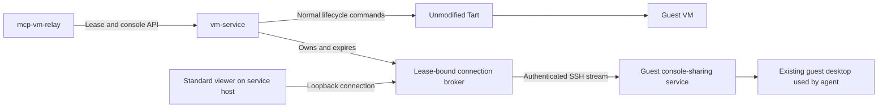

# vm-service design

## Status and required outcome

- **The stock-Tart replacement is implemented in working source, but deployment and live acceptance remain incomplete.** The rejected implementation was removed from branch history. The new source implements guest-sharing adapters, supervised connections, console API/CLI operations, installation configuration, and a matching relay consumer without restoring the Tart patch.
- [The implementation report](capability-transparency-verification.md) distinguishes automated source verification from the required real installation, image preparation, and viewer acceptance.
- **Tart must remain an unmodified upstream installation.** This project must not ship a Tart fork, apply source or binary patches, inject code, change private framework fields, or revive the rejected startup patch under another name.
- Completion means that installing or upgrading vm-service through its supported deployment procedure, then building and upgrading mcp-vm-relay, provides the requested viewing workflow. A private test executable, temporary service configuration, or separately assembled launcher is not delivery.
- The user must be able to watch the same desktop that the agent operates. Closing the viewer must leave the VM and agent running. Viewing failure must be reported before work that requires observation begins.
- Ordinary VM acquisition, SSH execution, transfers, heartbeat, release, and selected environments retain their existing non-VNC behavior. Acquisition-option discovery, resolved-configuration reporting, and the console operations below are now implemented in source; they are not enabled on the running production service by editing these files.

## Decision: separate VM execution from desktop sharing

- vm-service will use stock Tart only for the VM lifecycle. VNC will be provided inside the guest and carried through an authenticated SSH connection, rather than through a patched host Virtualization.framework server.
- The guest sharing backend must attach to the existing graphical console. Starting a new Xvnc desktop, an independent login session, or a remote-login desktop does not satisfy this requirement.
- The service will own a bounded local connection broker and the guest connection. mcp-vm-relay will request opening through a versioned service contract; it will not run Tart, guess guest endpoints, obtain passwords, or parse backend logs.
- This is the selected replacement direction, not a claim that its macOS authentication and isolation requirements have already been demonstrated. The platform checks below must be resolved by implementation research and isolated acceptance, without changing Tart.

## Platform mechanisms

### Linux guests

- The first Linux target is an existing X11 console with a maintained screen-scraping VNC server such as x11vnc. Its inetd mode can exchange RFB over a private stream instead of exposing a guest TCP listener.
- The service will launch the fixed guest adapter through the existing lease SSH identity. It will not remove `ClearAllForwardings=yes` from ordinary execution or transfer helpers simply to obtain a tunnel.
- The adapter must verify the logged-in console user, display, authorization file, and existing session before attaching. It must not create another desktop when those checks fail.
- An image using Wayland is not automatically supported by an X11 backend. It needs its own supported same-session sharing mechanism and acceptance, or an explicitly maintained X11 image profile. The service must not silently switch an active session or bypass compositor permissions.

### macOS guests

- The macOS target is Apple's built-in Screen Sharing for the existing console session. The guest image or documented clone preparation must enable it through supported configuration and grant the required user permissions.
- A viewer must select the existing shared display, not a separate virtual display or a new login session. Screen Sharing and Remote Management are not interchangeable settings; the backend must declare which supported mode it requires.
- The transport can connect to the guest's local Screen Sharing endpoint through a fixed guest-side stream adapter over SSH. The implementation must authenticate the guest endpoint and prove the stream closes when its owner or deadline disappears.
- A stream through SSH does not restrict the guest server's other listeners. Before this backend can be advertised as supported, its network exposure must be constrained and tested independently. NAT and a loopback viewer address alone are not proof of isolation.
- Authentication must use a standard viewer's supported interface. A normal native authentication prompt is acceptable as an explicit user step, but it must not be mistaken for an opened and authenticated desktop. Automatic authentication needs a verified private credential interface; credentials must never be embedded in a URL, argv, or model response.
- The initial viewer choice is Apple's Screen Sharing with an explicit guest-account authentication prompt, Standard sharing, and the existing shared console. If offered a separate Log In session or a High Performance virtual display, the workflow must not select it as a substitute. Observe mode alone is not server-enforced denial of control.
- The implemented macOS preflight requires guest-local top-level quick ingress filtering, no PF translation rules or translation-anchor references, no non-loopback skipped interfaces, and no existing external VNC states. It is deliberately incompatible with an unreviewed default Apple translation policy. [Guest preparation](guest-console-provisioning.md) describes the supported candidate; external reachability on both IP families still needs live acceptance. No host-wide firewall change is made.
- The implementation must establish supported image provisioning, same-console behavior, authentication, network restrictions, and any macOS consent requirements. It must not replace these checks with undocumented password-file manipulation or private-framework patching.

## Stock Tart compatibility

- Stock Tart already provides VM access and VNC-related options. Patching Tart is not an inherent requirement for VNC; it was a dependency introduced by the rejected design.
- The inspected Tart `--vnc` guest-sharing path resolves an address but does not configure or secure the guest server. The revised service will prepare and verify guest sharing itself rather than treating that flag as readiness.
- The inspected `--vnc-experimental` path produces a password-bearing URL and a host-side private-framework VNC server. This design does not select that path because wrapping it in a loopback proxy would not by itself restrict the original listener or prove access revocation.
- Tart's normal graphical window is also not a replacement: closing the stock VM window can stop or suspend the VM, contrary to the independent viewing lifecycle.
- The previous live experiment found a headless startup stall with stock Tart 2.32.1 on the tested prerelease macOS host. Guest-side sharing does not fix a VM that cannot boot.
- The compatibility work must select and test an unmodified upstream Tart release and supported host combination, or obtain an upstream fix released through the normal distribution. An incompatible host must be reported explicitly, not bypassed with the deleted local patch. No successful stock-runtime boot on that failing host is claimed here.

## Responsibilities

- vm-service owns fresh lease identity, configuration resolution, guest readiness, console preparation, connection lifetime, and cleanup.
- pilot-images owns reusable image prerequisites and permissions. Any required image version must be declared in the supported deployment procedure; the service must not edit a golden image in place.
- The vm-service installation owns service-side dependencies and configuration. Any guest setup performed after acquisition must be fixed, versioned, repeatable, and limited to the new clone, not an ad hoc shell script supplied by a caller.
- mcp-vm-relay owns the user-facing viewing request, agent-session association, explicit open and cancel actions, and screenshots/evidence for the agent workflow.
- A standard viewer owns display rendering and supported interactive authentication. A custom native viewer is not part of this design.

## API and compatibility

- `GET /acquisition-capabilities` describes options and configured host prerequisites without allocating a VM, starting sharing, generating credentials, opening a tunnel, or launching a viewer. The existing networking `/capabilities` contract remains unchanged.
- Capability reporting must distinguish supported, unavailable, unsupported, and unverified configurations. Image names or installed packages alone cannot prove same-session viewing works.
- The proposed `vnc` acquisition option defaults to false. A fresh VNC-enabled lease must prepare the supported guest-sharing path and validate its readiness; it must not open a viewer automatically.
- New leases will receive a distinct acquisition identifier. Opening must also identify the console instance and attempt, preventing stale requests from attaching to another lease or replaying an uncertain launch.
- The proposed configuration report will distinguish normalized requests, resolved instructions, command acknowledgment, and observed readiness. It will preserve the existing resource defaults and legacy fields without inventing configuration for older leases.
- [The acquisition contract](acquisition-contract.md) and [the console contract](console-contract.md) define the new source interfaces. Their status fields distinguish preflight checks, transport observations, and unverified authentication or pixels.

## Trust, access lifetime, and cleanup

- The existing household-trust model remains in place. Lease identifiers and selected-environment fingerprints prevent mistakes; they do not authenticate API callers against hostile users.
- VNC and guest-login secrets must remain outside logs, argv, public responses, portable state, and evidence packages. New private storage must be protected against the existing host-file transfer routes.
- Console access ends at lease TTL, independently of the VM destruction grace period. Expiry must close existing connections as well as prevent new ones, without waiting behind long-running guest operations.
- The connection worker must have its own bounded deadline and a control channel whose loss closes access. Killing or restarting vm-service must not leave orphaned tunnels or reopen viewers. These are implementation requirements, not inherited guarantees of SSH.
- Guest sharing and network restrictions must prevent direct connection from bypassing the managed access lifetime. Where a built-in guest server cannot be stopped reliably, its independent exposure and authentication must not be represented as revoked merely because the local broker closed.
- Cancelling or closing a viewer does not release the VM. Release revokes console access before waiting for VM destruction. Connection cleanup, viewer exit, guest-server cleanup, and VM destruction are reported separately.

## Deployment is part of delivery

- The normal installation procedure must validate the upstream Tart executable and host compatibility, required guest image revisions, a usable standard viewer, and all service-side adapters before reporting VNC available.
- The procedure must explicitly install or document each dependency and write persistent configuration. Nothing may depend on a `/tmp` checkout, a retained experimental executable, a developer's current shell variables, or a test-only adapter.
- Installation must preserve the selected environment, bind address, existing defaults, and unrelated leases. Upgrade and rollback must not silently restart or replace an active VM to change its console support.
- The relay build must consume the versioned capability and console contract. It must distinguish an old backend, missing prerequisites, an incompatible image, and an authentication prompt awaiting the user.
- A restart alone is not deployment acceptance. The installed service and the newly built relay must complete the actual requested workflow using the configuration that remains after restart.

## Acceptance and completion

- [The acceptance specification](vnc-acceptance.md) requires installation/upgrade checks, real stock-Tart boots, Linux and macOS same-console verification, two changing random visual challenges, and tests through the real relay/viewer path.
- Screenshots must be captured from the viewer side. A vision evaluator must receive those images without the expected answers, and its observations must be compared against independently retained source expectations.
- Agent screenshots and viewer screenshots must agree on the same guest content. Successful VNC viewing alone does not repair or verify a separate relay capture failure.
- Tests must verify viewer closure, cancellation, natural TTL expiry during a long guest operation, service loss, stale identities, selected stores, rollback, and cleanup. Connection or process launch is not evidence of displayed pixels or human confirmation.
- Each platform passes separately. An unavailable macOS backend cannot be hidden behind a Linux-only success claim.
- The task remains incomplete until the supported install/upgrade path and relay workflow pass. The previous patched-runtime screenshots are historical evidence only and cannot count toward this design's acceptance.

## Related documents

- [The mechanism investigation](live-console-review.md) records source evidence, rejected alternatives, and unresolved platform checks.
- [The current verification status](capability-transparency-verification.md) records the rollback and distinguishes historical tests from current acceptance.
- [Selected environments](selected-environments.md) and [per-lease SSH keys](lease-ssh-keys.md) define existing boundaries that the replacement must preserve.
- [Historical documents](history/README.md) retain the rejected design for traceability, not installation or reuse.
