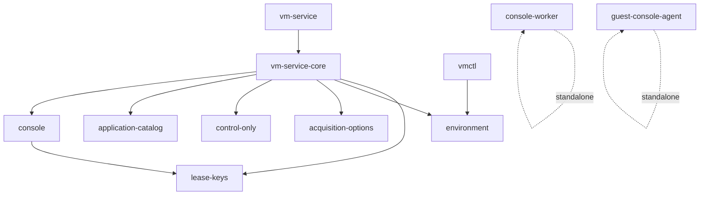

# Rust translation plan

## Purpose and scope

The Python `vm-service` is translated into a Rust workspace that preserves its
observable behavior. The translation covers the whole host-side service and the
guest-side console agent.

- The daemon (`bin/vm-service`), the CLI (`bin/vmctl`), and the console/VNC
  subsystem are ported.
- The guest console agent (`bin/guest-console-agent.py`) becomes a native Rust
  binary that the host delivers to the guest per lease.
- The Python unit and integration tests are ported into Rust tests.
- The Python sources remain in `bin/` during the transition as the behavioral
  specification. They are not deleted by this translation.

## Scope decisions

| Question | Decision |
|---|---|
| Translation scope | Full parity, including the console subsystem |
| Guest console agent | Ported to Rust and delivered as an embedded binary |
| Tests | Ported to Rust |
| Layout | A Cargo workspace beside `bin/`, leaving the Python in place |

## Workspace layout

The workspace lives at `rust/`. One crate per Python module group keeps the
dependency graph acyclic and lets each module be ported and tested in isolation.

`console` must not depend on `vm-service-core`. `lease-keys` must not depend on
any other workspace crate.

## Compatibility contract

The translation preserves behavior rather than reinterpreting it.

- The HTTP API keeps the same paths, methods, status codes, JSON field names,
  and error strings.
- The CLI keeps the same subcommands, flags, defaults, human-readable output,
  `--json` output, and exit codes, and it prints the same `--help` text and the
  same diagnostics for invalid input, which come from a port of CPython's
  `argparse` formatter rather than from clap. On a terminal both are coloured
  the way `argparse` colours them.
- The on-disk state file, the per-lease SSH key layout, the selected-environment
  marker, and the application-catalog files keep the same shape and permissions.
- Every security check keeps its order, its predicates, and its fail-closed
  behavior. Text is split the way CPython splits it: `str.splitlines()` breaks
  on `\r`, `\v`, `\f`, U+001C through U+001E, U+0085, U+2028 and U+2029 as
  well as `\n`, while Rust's `str::lines()` breaks on `\n` alone. Every call
  site whose Python counterpart uses `splitlines()` therefore calls a port of it
  (`vm-service-core/src/python.rs`, `guest-console-agent/src/python.rs`). A
  splitter that sees fewer lines can turn a rejected policy into an accepted
  one, so this is a security property rather than a formatting detail.
- Address and host predicates follow CPython's `ipaddress` rather than the
  nearest Rust equivalent, because the two disagree. A loopback check also
  accepts an IPv4-mapped address whose mapped address is loopback
  (`::ffff:7f00:1` is loopback; `::ffff:8.8.8.8` is not); `ipaddress.ip_address`
  accepts a zone-qualified IPv6 literal (`fe80::1%eth0`); and the console guest
  address accepts a JSON integer or boolean the way `ipaddress.ip_address`
  accepts an `int`. `Ipv6Addr::is_loopback` and `IpAddr::from_str` cover only
  part of this. Each site was corrected against measured CPython 3.14.7
  behaviour: `console/src/sessions.rs` (`normalize_ip`),
  `guest-console-agent/src/macos.rs` (`is_loopback`), and `lease-keys/src/lib.rs`
  (`is_ip_literal`). `normalize_ip` reproduces `str(ipaddress.ip_address(x))`
  for text input, which includes reassembling an RFC 4007 scope id verbatim and
  rendering a v4-mapped address as `::ffff:a.b.c.d` rather than in hexadecimal
  groups.
- Routing compares the raw request target, as CPython's
  `BaseHTTPRequestHandler.self.path` does, so a query string makes a request
  unroutable instead of being ignored.
- CPython's Unicode-aware regular-expression classes and character predicates
  are implemented exactly where the macOS guest console depends on them: `\s`
  (Unicode whitespace plus U+001C-U+001F), `\w` and the `\b` boundary
  (`str.isalnum()` or `_`), and `str.isdigit()`. Rust's nearest equivalents
  (`char::is_whitespace`, `char::is_alphanumeric`, `is_ascii_digit`) each differ
  from CPython on some code points, so code-point tables were generated from
  CPython 3.14.7 and compared over every one of the 0x110000 code points. The
  port therefore agrees with the original on inputs no vendor output produces.
  A predicate is only exact where every call site uses it, so `verify_pf` strips
  and splits with `python_strip`, `python_lstrip` and `python_split`, and
  `contains_port_5900` applies `python_word` after the literal, rather than
  Rust's `trim`, `is_whitespace` or an ASCII-only word test.
- `rust/CONVENTIONS.md` records the shared conventions and the exact cross-crate
  interfaces.

### Audit corrections

An independent audit of revision `9efcd7c` re-derived the contract from the
Python sources and found several places where the port did not hold it. All of
them are corrected and pinned by a test. The last one needed a further step,
because clap could not be configured into the reference layout: `vmctl` now
renders `--help` with a port of CPython's `argparse` formatter.

- **Query strings.** The daemon stripped the query string before routing, so
  `/health?x=1` answered 200 where Python answers 404, and a mutating route such
  as `/acquire?x=1` executed where Python refused. Routing now compares the raw
  request target.
- **Scoped and v4-mapped addresses.** `normalize_ip` rejected a zone-qualified
  IPv6 literal and rendered `::ffff:7f00:1` in hexadecimal groups. It now
  reproduces `str(ipaddress.ip_address(...))` for those inputs.
- **Word boundary.** The `5900` scan used an ASCII word test, so `x:5900é`
  matched where CPython's `\b` does not.
- **Whitespace predicates.** `verify_pf` used `trim` and `char::is_whitespace`
  rather than the file's own CPython-equivalent predicates, so it differed on
  the ASCII information separators U+001C-U+001F.
- **Large integers.** `normalize_ip` rejected a JSON integer above `u64::MAX`,
  because `serde_json` had already parsed it as a `f64`; CPython's
  arbitrary-precision `int` accepts it as an IPv6 address. The workspace now
  enables `serde_json`'s `arbitrary_precision` feature and `normalize_ip` reads
  the integer's exact digits, so a 128-bit address written as an integer is
  reachable and an integer at or above 2**128 is still rejected. A workspace
  feature is additive and applies to every crate, so the switch also changed how
  a *float* literal is handled; the second audit below covers that.
- **State-load error text and state-file escaping.** A state-load failure now
  reports `selected service state is unreadable or invalid` with no appended
  Rust detail, as Python does, and the state file escapes non-ASCII code points
  the way Python's default `ensure_ascii` does.
- **Help surface and layout.** clap's extra `help` subcommand is disabled,
  because argparse treats `help` as an invalid choice and exits 2. `--help`
  output is no longer rendered by clap at all: `vmctl` builds an argparse model
  from its own clap definitions and formats it with a port of CPython's
  `HelpFormatter` and `textwrap`, so the output is byte-identical to the Python
  client's at every terminal width. A corpus generated from the Python client at
  widths 20, 24, 25, 30, 33, 40, 80, 120, 160, 240 and 300 is checked in and
  compared byte-for-byte on every test run, and `COLUMNS` is parsed with a port
  of Python's `int()`, so a signed, underscored or non-ASCII decimal value
  selects the width Python selects.

A second audit, on revision `b04da19`, re-derived the contract again and found
six further divergences. All six are corrected and pinned by a test whose
expectations were measured on CPython 3.14.7.

- **Line splitting.** `verify_pf` and the other text parsers used Rust's
  `str::lines()`, which breaks on `\n` alone, where Python's `str.splitlines()`
  also breaks on `\r`, `\v`, `\f`, U+001C through U+001E, U+0085, U+2028 and
  U+2029. The difference was fail-open: a PF state whose second endpoint sat
  behind such a break was invisible, so `all tcp 127.0.0.1:5900\u000b->
  127.0.0.1:5` passed the check here and failed in Python with
  `pf_existing_connection`. Every call site whose Python counterpart calls
  `splitlines()` now calls the port. One site keeps `lines()` deliberately: the
  `program =` match in the macOS launchd check mirrors a Python regex compiled
  with `re.MULTILINE`, whose anchors recognize `\n` only.
- **Scope characters.** `normalize_ip` and `is_ip_literal` rejected a zone id
  containing `%` but accepted one containing `/`, where CPython's
  `_split_scope_id` rejects both. Both now reject `%` and `/`.
- **Non-ASCII escaping in `vmctl`.** `vmctl`'s `ensure_ascii` escaped every code
  point above U+007F, which left U+007F itself unescaped; Python escapes it as
  `\u007f`. The state-file writer already used the correct bound and was not
  affected.
- **`COLUMNS` parsing.** `COLUMNS` was parsed with Rust's `i64::from_str`, which
  rejects `1_0` and non-ASCII decimal digits. A port of Python's `int()` now
  parses it, including the 71 Unicode decimal-digit ranges, and a value Python
  rejects falls back to the terminal width and then to 80, as
  `shutil.get_terminal_size` does.
- **Float literals.** `arbitrary_precision` keeps the original text of a float
  literal, so the port stored, hashed and echoed `0.10` and `1e2` where Python
  normalizes them to `0.1` and `100.0`, and `1e309` to `Infinity`.
  `environment/src/python_json.rs` now rewrites every float literal to CPython's
  `repr` of the parsed value at each boundary that parses external JSON: the
  environment profile, the environment marker, the lease fingerprint check, the
  service state, and a request body. An integer literal keeps its exact digits.
- **Malformed state documents.** A state document whose root is not an object,
  or whose `vms` member is not an object, was silently replaced by an empty
  state. Python raises `AttributeError` there, which a selected environment
  reports as an unreadable state, so the port now reports that same failure.
  Legacy mode continues to discard unreadable state.

### Residual parity items, closed

A final pass closed the items that earlier rounds had recorded as residuals or
had left unverified. Each one is pinned by a test or by a differential against
CPython.

- **Live lease on the Rust daemon.** An `ubuntu2404` lease was acquired, probed
  over SSH, exercised with `push` and `pull`, and released, after which the
  state file held no leases. A second lease was acquired with `--vnc`, and its
  console was resolved, opened and cancelled; the guest agent in that VM was
  the same binary the host installs.
- **Environment float literals.** `parse_strict` rejected `"schemaVersion":
  1.0` because the workspace-wide `arbitrary_precision` feature delivers a
  float to a visitor as a one-entry map, which the strict visitor stored as an
  object. Parsing now runs a strict pass for duplicate-key rejection and a
  normal pass for the value, so `1`, `1.0`, `1e0` and `1.00` are accepted and
  the rejections are unchanged.
- **Relay fixture discovery.** `mcp-vm-relay`'s environment-parity test
  resolved the deleted `bin/vmctl` and skipped silently. It now resolves
  `VMCTL`, then `PATH`, then the Rust release binary, and skips only with a
  stated reason. The same repair was applied to the console test and to the
  report generator.
- **Terminal width.** Help output was compared through a pty at widths 20, 30,
  40, 80, 120, 200 and 300 with `COLUMNS` unset, so the `ioctl(TIOCGWINSZ)`
  fallback is exercised rather than assumed.
- **Help colour.** `vmctl` now reproduces `argparse`'s coloured help and its
  coloured error usage on a terminal, including the `_colorize.can_colorize`
  gate (`PYTHON_COLORS`, `NO_COLOR`, `FORCE_COLOR`, `TERM=dumb` and `isatty`)
  and the rule that every measured width uses the decolored text.
- **`textwrap` character classes.** The port used Rust's
  `char::is_alphanumeric` and `is_ascii_digit` where CPython's `textwrap` uses
  the `\w` and `\d` classes of a `str` pattern. The measured `\w` exception
  table and the Unicode `Nd` ranges now back both predicates, and a test
  compares them with CPython over every code point.
- **Diagnostics for invalid input.** `clap` still parses, but a rejected
  command line is now rendered by a port of `argparse`'s error path: the same
  wording for a missing required argument, an invalid choice, a missing option
  value, an invalid `int` or `float`, an ambiguous option and an unrecognized
  one; the same choice list and declaration order; the same decision to show
  the subparser's usage line or the top-level one; and exit status 2.

## Deliberate deviations

The following differences are required by the move from Python to native
executables. Each one is a transport or implementation detail; none changes the
service contract.

- **Guest agent delivery.** The Python host embeds the agent source as base64 in
  the SSH argument vector. A native binary can exceed the per-argument limit, so
  the host uploads the agent once per lease over SSH standard input to
  `$HOME/.vm-service-console/agent` (mode `0700`) and then runs that path. The
  agent still reads exactly one JSON configuration line from standard input and
  then relays binary RFB over the same stdin and stdout.
- **Console worker launch.** `console_sessions` launches the native
  `console-worker` binary instead of `sys.executable console_worker.py`, located
  by `VM_CONSOLE_WORKER` or as a sibling executable.
- **SSH_ASKPASS helper.** `lease_keys` writes a small POSIX `sh` helper that
  prints `$VM_SERVICE_SSH_PASSWORD` instead of a Python one-liner, because no
  Python interpreter is assumed. The environment variable and the guarantee that
  the password never reaches the argument vector are unchanged.
- **macOS plist reading.** The guest agent reads a plist through the system
  `plutil -convert json` instead of Python `plistlib`.
- **JSON escaping of non-ASCII in HTTP responses.** Python escapes non-ASCII by
  default and `serde_json` leaves it raw. A client that parses JSON cannot tell
  the two apart. The on-disk state file is not affected: it escapes non-ASCII,
  and therefore matches Python's bytes. The application-catalog digest covers
  raw file bytes and is unaffected either way.
## Faithfully reproduced upstream behaviour

The translation preserves observable behaviour, including defects. These are
deliberate reproductions, verified against the Python original rather than
inferred; repairing them would be a behaviour change, so they are left to the
original project.

- **The macOS console session step rejects real `ioreg` output.** `mac_session`
  (`bin/guest-console-agent.py:175-177`) parses the document with
  `plistlib.loads` and then reads `roots[0]["IOConsoleUsers"]`. The parsed
  top-level value is a dict, so `roots[0]` raises `KeyError(0)`, which the
  surrounding `except` maps to `session_metadata_invalid`. The port mirrors
  this: `parse_plist` returns the same dict, `roots.get(0)` yields `None`, and
  the step reports `session_metadata_invalid`. Verified by running CPython over
  a verbatim capture of `ioreg -a -d 1 -n Root` from a macOS host:
  `plistlib.loads` returns a `dict` and `roots[0]` raises `KeyError(0)`.
  `rust/crates/guest-console-agent/tests/real_ioreg_parse.rs` pins the
  agreement and uses that capture as its fixture, which also proves the
  hand-written plist reader accepts real vendor output (XML prolog, DOCTYPE,
  `<plist version="1.0">` wrapper, nested `<dict>`/`<array>`, `<integer>` and
  `<string>` scalars, self-closing `<true/>`, and escaped `&lt;`/`&gt;`).
  A macOS console therefore cannot become ready on a document of this shape in
  either implementation.
- **The `vmServiceUrl` host allow-list is narrower than a loopback check.**
  `bin/environment_config.py:73` gates the value with a `re.fullmatch` against
  `http://(localhost|127\.d{1,3}\.d{1,3}\.d{1,3}|\[::1\]):d{1,5}/?` *before*
  line 81's `ipaddress.ip_address(host).is_loopback` can run. Hosts that would
  satisfy the later check, such as `[::ffff:7f00:1]`, `[0:0:0:0:0:0:0:1]` and
  `LOCALHOST` (which `urlsplit` would otherwise lowercase), are therefore
  rejected. The port mirrors the gate, and `crates/environment/src/config.rs`
  records that widening it would be a parity regression rather than a fix.
  `url_parity::test_url_allowlist` pins the accepted and rejected forms, and an
  independent audit re-derived the comparison against the real
  `canonical_profile` over a generated cross-product of schemes, hosts, ports,
  paths, and userinfo, and found no mismatch.

## Phases

| Phase | Deliverable | Status |
|---|---|---|
| 0 | Workspace skeleton and conventions | Complete |
| 1 | Foundation crates: `lease-keys`, `environment`, `acquisition-options`, `control-only`, `application-catalog` | Source-complete, tests ported and passing |
| 2 | Console subsystem: `console`, `console-worker`, `guest-console-agent` | Source-complete, tests ported and passing |
| 3 | Service core and daemon: `vm-service-core`, `vm-service` | Source-complete, tests ported and passing; the daemon startup-order/bind/GC cases are `#[ignore]`d because that behavior lives in `vm-service/src/main.rs` and `vm-service-core` has no seam for it |
| 4 | Client: `vmctl` | Source-complete, tests ported and passing |
| 5 | Installation and deployment: `vm-service-install`, `runtime-launcher` | Source-complete, tests ported and passing |
| 6 | Live acceptance on real images and viewers | Partial: the Linux guest path is live-accepted end to end on real Tart (acquire/boot/SSH, agent delivery, probe, RFB relay, worker transport, open/cancel, release, cleanup). The macOS guest console path is ported, unit-tested and source-parity-audited, but live acceptance needs Screen Sharing consent, a human guest account, and a free macOS guest slot |

## Test strategy

- Each crate ports the Python unit tests that cover it, using
  `tempfile::TempDir` fixtures and fake executables.
- Tests that require a real `tart` installation, a booted guest, or a viewer are
  marked `#[ignore]` with the reason, and are driven by the live acceptance
  phase instead.
- `cargo test --workspace` is the translation's source-level gate.
- The single Python test suite remains an independent oracle and can be run
  against the Rust binaries during phase 6.

## Risks

- **Behavioral drift in dynamic JSON.** The Python code manipulates dictionaries
  freely. The Rust port uses `serde_json::Value`, and null-versus-absent and
  integer-versus-float distinctions must be preserved deliberately.
- **Subprocess timeout fidelity.** Rust has no equivalent of
  `subprocess.run(timeout=)`. A polling wait helper must kill on expiry so no
  operation blocks past its Python deadline.
- **Concurrent state.** The daemon serializes threads with a mutex and processes
  with an `flock`. The Rust port must keep both layers, because `tart` and `ssh`
  operations run outside the lock.
- **Live-only behavior.** Boot timing, macOS Screen Sharing consent, and pf
  isolation cannot be verified from source tests. They remain phase 6 work.

## Status discipline

Source completion and deployment are separate. A crate that compiles and passes
its ported tests is source-complete. The service is accepted only after the
installed binaries complete the acquisition, console, and release workflow on
real images and a real viewer.

## Integration notes

- `vmctl` enables the `serde_json` `preserve_order` feature for byte-for-byte
  CLI output. Cargo unifies additive features across a workspace build, so every
  cross-language digest and the state file serializer now sort object keys
  explicitly instead of relying on `serde_json`'s default ordering.
- The guest agent is delivered by uploading the native binary once per lease to
  `$HOME/.vm-service-console/agent`; the agent reads exactly one JSON
  configuration line from standard input and then relays binary RFB over the
  same stdin and stdout.
- `console` locates `console-worker` through `VM_CONSOLE_WORKER`, or as a
  sibling of the running executable.
- The macOS guest console path has no live acceptance yet, so it carries a
  source-parity audit against `bin/guest-console-agent.py` in addition to its
  ported tests. The audit found no blocking divergence; its two residual
  cosmetic findings are recorded under "Deliberate deviations" above. The
  macOS `mac_session`, `mac_isolation`, `mac_endpoint`, `mac_ready` and
  connector cases are covered by ported tests that fake the inspection
  commands through a test-only per-thread seam, mirroring the Python tests'
  monkeypatching.
- The guest agent is machine code, so it is resolved per guest kind:
  `VM_GUEST_CONSOLE_AGENT`, then `guest-console-agent-<kind>`, then the
  host-native `guest-console-agent`. `scripts/build-guest-agents.sh` produces
  both artifacts, and `vm-service-install` refuses to install without
  `guest-console-agent-linux`. This is a deviation the Python original did not
  need: `bin/guest-console-agent.py` ran on any guest with an interpreter. A
  Linux guest cannot execute the macOS build — the probe fails with
  `Exec format error`, which is reported as a pending `probe_unanswered` until
  the prepare deadline and rolls the lease back.

## Removal of the Python implementation

The Python implementation and its test suite were removed once the Rust port had
been verified against them, because the port replaces the original rather than
accompanying it. Removed in the same commit as this note: `bin/*.py`,
`bin/vm-service`, `bin/vmctl` and all of `tests/**`. Kept because they are not
Python: `bin/runtime-launcher.c` and the documents under `docs/`.

`bin/install-vm-service.sh` was kept at first as the other non-Python file. It
stopped working when the Python modules it imported were removed, and it was
deleted once `rust/crates/vm-service-install` was deployed as the installer of
record.

`rust/` is now the implementation of record. Every reference in this document to
a Python file and line number, and every `#[ignore]` reason naming a Python test,
cites the specification the port was verified against; those sources remain
recoverable from this repository's history.

One ported test fixture needed an accompanying change.
`crates/environment/tests/environment.rs` filled its `vmctlPath` from the Python
`bin/vmctl`, which the resolver requires to be an executable regular file, so the
fixture now synthesises an executable stand-in in its own temporary directory —
the same arrangement it already used for `tart`. No assertion was affected: the
fixture never executed that path, and nothing in the suite compares its value.
